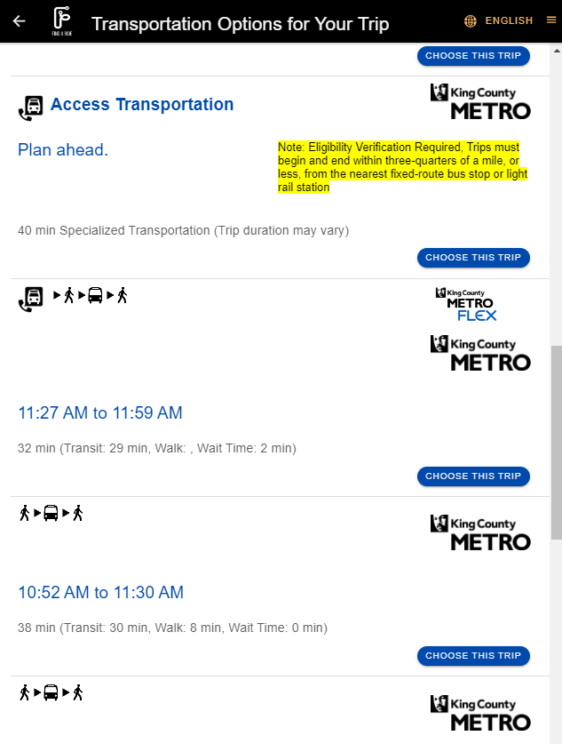
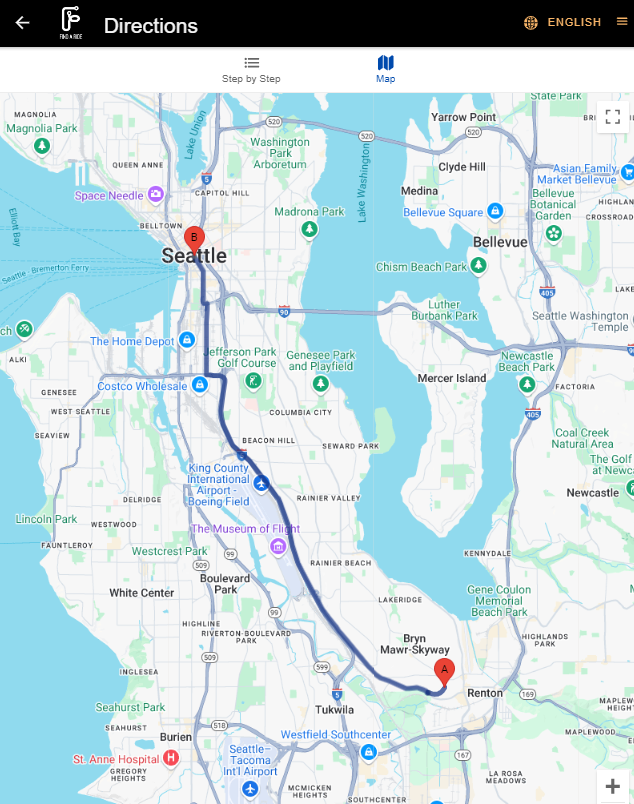

# Case studies

## Hopelink’s Find a Ride Community-Driven Approach to Technology Solutions 

Hopelink is a nonprofit organization that provides social services and support to low-income families, individuals, older adults, and people with disabilities in Washington state.  Hopelink partnered with the [King County Mobility Coalition] (https://www.kcmobility.org/) (KCMC) to develop the [Find a Ride] (https://www.kcmobility.org/ococ) platform, an iteration of the one-call/one-click system. The platform enables people with disabilities and older adults in Snohomish, King, and Pierce Counties to learn about available transportation services and map their trips using a [trip planner] (https://tripplanner.findaride.org/locator/transportation).

The trip planner is focused on incorporating specialized transportation side by side with General Transit Feed Specification (GTFS) transit services. Approximately 45 transportation services are currently displayed through Find a Ride and another five are expected to be added by the end of 2024. These travel options currently include public transit, volunteer transportation providers, non-emergency medical transportation, on-demand last-mile services, walking, and biking. On-demand services like [Metro Flex] (https://kingcounty.gov/en/dept/metro/travel-options/metro-flex), [Pierce Runner] (https://www.piercetransit.org/Runner/), and [Zip Alderwood] (https://www.communitytransit.org/services/zip-shuttle-alderwood) shuttle do not have rider eligibility criteria, increasing their potential to be adopted in other trip planning platforms because the rider approval step is not required. Other on-demand examples discoverable through Find a Ride include Snoqualmie Valley Transportations’ [Door-to-Door service] (https://svtbus.org/door-to-door/). 

### Find a Ride Trip Planning Platform

<figure>
  
</figure>
<figure>
  
  <figcaption>Credit: Find A Ride. On the landing page riders enter their travel origin, destination, and travel times and are then provided trip planning options.</figcaption>
</figure>

In addition to leveraging data standards to increase access to specialized transportation services, Find a Ride’s community-driven process makes it unique. The Mobility Data Interoperability Principles coalition has published five guiding principles on the importance of open-source data solutions and how agencies can incorporate an open framework in their own communities. Hopelink’s community-driven process for the Find a Ride platform embodies the fifth interoperability principle:

	All individuals and the public should be empowered through high-quality, well-distributed mobility data to find, access, and utilize high-quality mobility options that meet their needs as they see fit, while maintaining their privacy.
	
Hopelink demonstrates its commitment to providing high-quality, accessible data through its inclusive planning practices and community engagement.

Equally important is Hopelink’s process to ensure that the Find a Ride platform is fully functional to all individuals, regardless of physical or cognitive need.  Hopelink works with people with disabilities to design and test the platform to understand how users engage with it, and if it meets their needs. Early trip planning platforms were often created in silos and if they involved the community it was often on a cursory level. While these platforms helped to demonstrate the potential of the technology, in many cases, they did not meet the needs of their intended users and were either left idle or underwent costly retrofits.

The one-call/one-click project is governed by KCMC and an advisory committee that includes academics, transportation agencies, community members with disabilities, and human service organizations that support older adults. The advisory committee meets regularly to guide the direction of the project.

While this level of engagement takes more time and resources, the benefits are far-reaching. It has helped to create a trip-planning platform that is designed with the end user in mind, creating further support for the project across local government agencies and mobility providers. Cities interested in pursuing similar efforts should create a community engagement plan and a dedicated budget to carry out this work.

Further building on its commitment to Principle 5, Hopelink conducts extensive outreach, collaborates with local tech firms and volunteer groups, and implements initiatives like digital literacy programs to leverage technology for community benefit. Through these efforts, Hopelink’s Find a Ride platform uses technology as a tool to promote self-sufficiency in the community.

Hopelink played a pivotal role in the creation of nearly two dozen new data feeds for the Washington State Department of Transportation (WSDOT), contributing to the development of the General Transit Feed Specification (GTFS)-Flex.1 GTFS-Flex expands on GTFS, an open-source data standard used by most transit agencies in the U.S. to include demand-responsive transportation and, when available, real-time information for on-demand services. These data standards advance the representation of critical transportation services such as volunteer transportation and non-emergency medical transportation (NEMT). Through travel education and collaboration with various sectors including transportation providers, human services agencies, and healthcare providers, Hopelink strives to ensure a more seamless trip experience. Throughout this process, Hopelink considers the trade-offs of adopting new technology and open-source data solutions–or data specifications and standards–before proceeding.

Open-source data is important in this process. Some of the benefits of using open-source data include:

- A framework to work from so that Hopelink does not need to reinvent how specific trip data is communicated each time a new mode or provider is added to the platform.
- Other platforms can readily digest that information into their own systems, such as Google or Apple Maps, making trip information more accessible.
- Replicability for other cities interested in creating a similar platform in their own communities.

Hopelink's collaboration with WSDOT to incorporate GTFS-Flex data into the department’s system enhanced efficiency and accuracy in the trip planning feature of the Find a Ride program. Hopelink's involvement with service providers demonstrates its proactive approach to understanding technology tradeoffs and identifying opportunities for improvement. By leveraging open-source data and actively engaging with technology partners, Hopelink ensures that its adoption of new technology aligns with its mission to enhance transportation access and the availability of social services to the community.

When determining a suitable developer for Hopelink's procurement process for the one call/one click program, Hopelink, along with stakeholders, evaluated the developer's commitment to ongoing community development and collaboration, along with their ability to deliver a robust, user-friendly platform that meets the needs of Hopelink and its diverse clientele.

Hopelink is committed to using open-source data solutions in its Find a Ride platform— supporting compatibility and interoperability across systems. As Find a Ride matures, and new data standards and mobility options are added to the platform, it will require further strategic considerations. Embracing emerging technologies, fostering a culture of innovation, and investing in continuous training and support for staff are important components. Additionally, establishing robust partnerships with technology vendors and staying abreast of industry trends will enable Hopelink to remain agile and responsive in leveraging technology to advance its mission of empowering communities. Hopelink's Find a Ride program demonstrates the transformative power of open-source data solutions and the importance of community engagement.

<figure>
  
  <figcaption>This is my caption text.</figcaption>
</figure>

!!! tip

    When capitalized in this document, the words “MUST", "MUST NOT", "REQUIRED", "SHALL", "SHALL NOT", "SHOULD", "SHOULD NOT", "RECOMMENDED",  "MAY", and "OPTIONAL" refer to their respective definitions in RFC 2119.

This document outlines the roles, policies, procedures, and structures that guide the collaborative and transparent stewardship of the Mobility Data Interoperability Principles  (“MDIP”) Project. The MDIP Project is a collaborative effort by government agencies, mobility service providers, and nonprofit organizations that are dedicated to changing the relationship between transit and technology. MDIP establishes a vision for the transit industry in which all mobility data is communicated by interoperable technology components using open standards. Interoperability is the next step for the software and hardware that support transit operations, planning, reporting, and the rider experience. It is a necessary condition for transit to keep pace with the changing world of personal mobility and to develop service that meets the expectations of the riding public.

## ODOT Accelerating Innovative Mobility project collaboration with CALACT and WSDOT

In 2023, the [Oregon Department of Transportation (ODOT)](https://www.oregon.gov/odot/pages/index.aspx) and [Washington State Department of Transportation (WSDOT)](https://wsdot.wa.gov/) worked with project management partner the [California Association for Coordinated Transportation (CALACT)](https://calact.org/) to release a request for proposals (RFP) for a regional transit data analysis and planning tool. The DOTs wanted to leverage well-known existing standards like the General Transit Feed Specification (GTFS), OpenStreetMap (OSM) to support transit planners visualizing the multi-state transit network, but they also wanted the new platform to be able to incorporate unknown future standards as well. Further, they knew the software used to develop the platform had to be capable of evolving as planning processes and the capabilities of other platforms changed.

The coalition worked together to develop a custom software development [scope of work] (https://calact.org/wp-content/uploads/2023/12/AIM-Grant-development-scope-of-work-12052023.pdf) that identified clear and measurable goals followed by additional project intentions. Three of the project intentions were about working style and key project approach assumptions. But the final intention covered a lot of additional specifics in a brief sentence: “Adhere to the Mobility Data Interoperability Principles.”

“The Mobility Data Interoperability Principles aren’t only about the common transit data software products that are ubiquitous at all agencies, like scheduling or CAD/AVL systems”, says Thomas Craig of the WSDOT Public Transportation Division. “MDIP is also about building new tools and systems, and maintaining business practices within our organizations, that benefit from and reinforce the open data ecosystem that benefits all transit software.”

After finalizing the procurement in Spring 2024, the project is proceeding with development. TIDES and other emerging data standards are in the long-term project plan, and MDIP will continue to serve as a framework to support ongoing decision making as the project and partnership evolve.

## MnDOT Mobility-as-a-Service Procurement

In October 2020, the Minnesota Department of Transportation (MnDOT) started its procurement process for a technology vendor for its regional Mobility-as-a-Service (MaaS) pilot, awarded under the Federal Transit Administration’s Accelerating Innovative Mobility (AIM) grant program. The project called for a data sharing platform built on an open architecture and using existing and emerging data standards to allow both project and third-party software providers access to transit and shared mobility provider data.

MnDOT partnered with the Minnesota Information Technology Department (MNIT) to develop a technology RFP that called for the creation of a MaaS data sharing platform, transit data feed developer, trip planner, payment system integrated within the trip planner, and a demand response booking portal integrated in the trip planner. Because no one technology company provides all of these services, MnDOT encouraged responses made up of a team of technology providers, with a prime contractor and other project partners as subcontractors.

In order to ensure maximum data interoperability, MnDOT asked RFP respondents to implement current data standards as well as emerging specifications with potential to be adopted by the broader transit industry as data standards. Existing data standards included the General Transit Feed Specification (GTFS) and General Bikeshare Feed Specification (GBFS). Use of provisional or experimental specifications included GFTS-Flex to describe flexible services like demand response and deviated route and GTFS-OnDemand (also called GOFS) to describe on-demand services like taxis, ride-hail, and microtransit services.

Projects that can include experimental or provisional specifications help move the transit industry towards more data interoperability. Incorporating emerging specifications as a project data standard is an important step towards standards adoption, as example implementation cases are needed to prove specifications utility ahead of broader acceptance. For example, MnDOT’s use of GTFS-Flex on this project by data producers (13 partner agencies) and consumers (Transit app and MnDOT’s web-based trip planner MnTransitPlanner.com) provided MobilityData, the steward of GTFS, the required use case to call a vote to adopt the Flex extension as part of GTFS. GTFS-Flex was officially adopted as part of GTFS in March 2023.